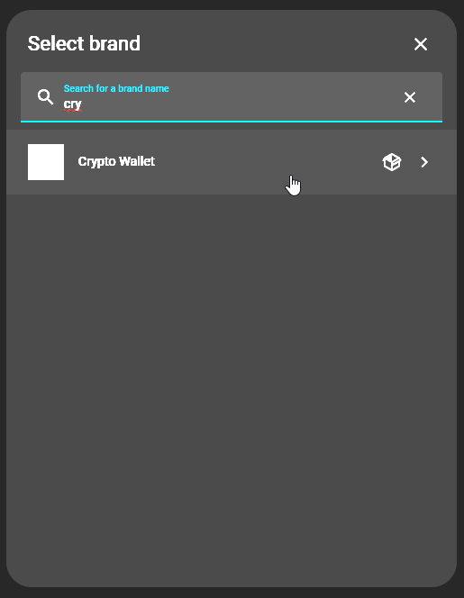
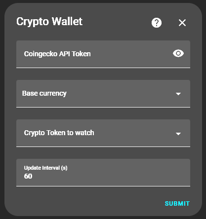
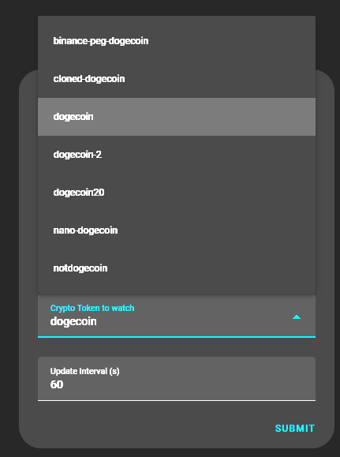
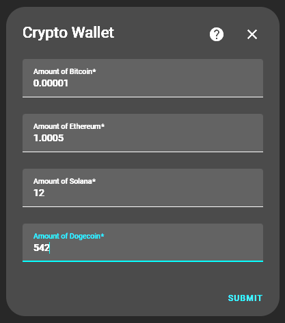
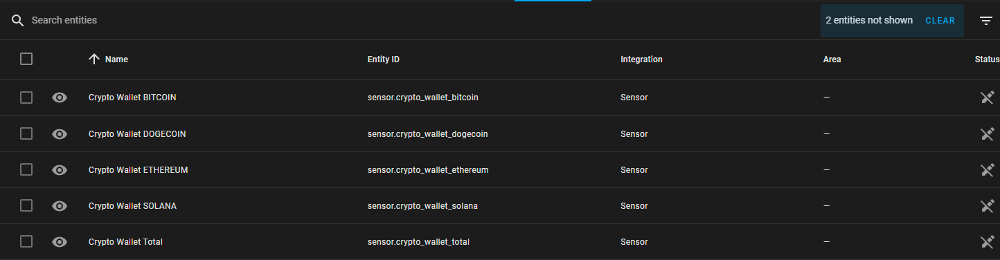

# CryptoWallet Integration

This project shall provide a custom integration for Home Assistant that provides the possibility to track a crypto
portfolio via Home Assistant by using the CoinGecko API.
Therefore, it provides a configuration flow where some parameters can be specified and edited:

## Parameters

There are several parameters that needs to be configured when the integration is added and also can be adjusted later.

Parameters:

- CoinGecko API key to be used for the query
- update frequency
- list of tokens to be tracked
- amount of the selected tokens to be tracked

### update frequency

Regarding the update frequency when using **Demo-API-Plan** the api calls are limited to 10.000 per month. This leads to
a limit of ~5min as update frequency.

```
update_frequency = 5 minutes
31 days * 24 hours * 60 minutes = 44.640 minutes
44.640 minutes / 5 minutes = 8928 API-calls
```

as all configured tokens are queries with a single api call there is no limitation regarding the number of configured
tokens

## Configuration flow

### Adding the integration



### Basic settings



### Select tokens



### Select token amount



### Created entities

For each token an entity is added and additionally a total sensor.


