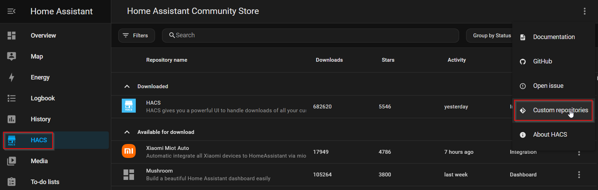
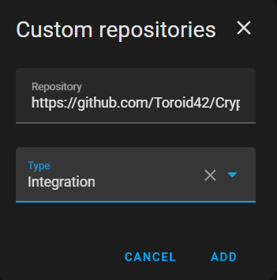
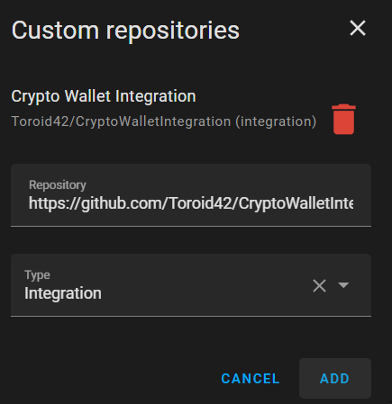
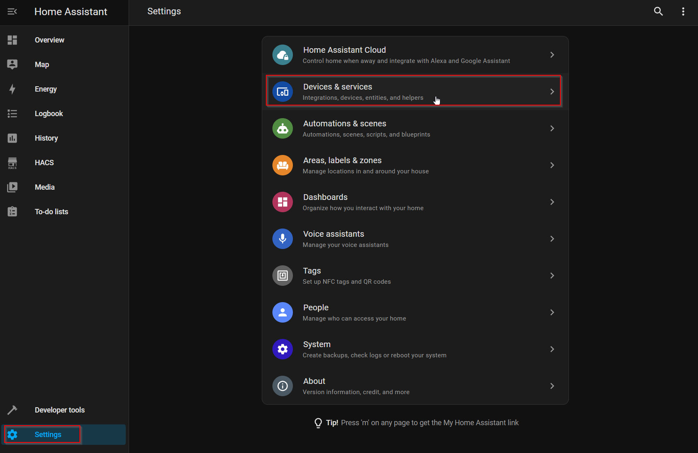
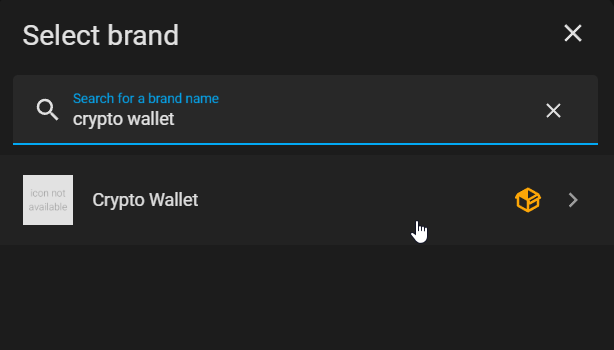
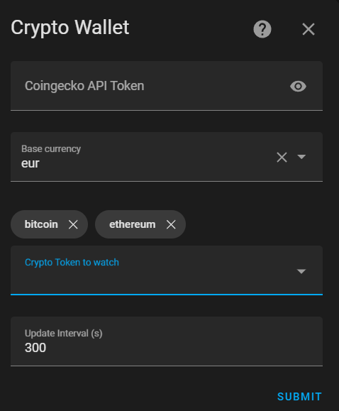
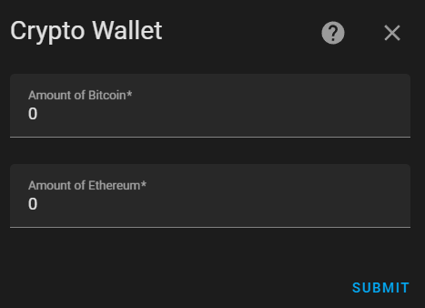

# CryptoWallet Integration

This project shall provide a custom integration for Home Assistant that provides the possibility to track a crypto
portfolio via Home Assistant by using the CoinGecko API.
Therefore, it provides a configuration flow where some parameters can be specified and edited.

## Parameters

There are several parameters that needs to be configured when the integration is added and also can be adjusted later.

Parameters:

- CoinGecko API key to be used for the query
- update frequency
- list of tokens to be tracked
- amount of the selected tokens to be tracked

### update frequency

Regarding the update frequency when using **Demo-API-Plan** the api calls are limited to 10.000 per month. This leads to
a limit of ~5min as update frequency.

```
update_frequency = 5 minutes
31 days * 24 hours * 60 minutes = 44.640 minutes
44.640 minutes / 5 minutes = 8928 API-calls
```

as all configured tokens are queried with a single api call there is no limitation regarding the number of configured
tokens

## Installation using HACS

### Installing HACS

First HACS needs to be added to your Home assistant installation,
see [Getting started with HACS](https://www.hacs.xyz/docs/use/#getting-started-with-hacs).

### Adding the repository

To install the integration this repository needs to be added as custom repository.



The [repository URL](https://github.com/Toroid42/CryptoWalletIntegration) needs to be added and the type **Integration**
is needed





### Select and configure the integration

Now the integration can be selected from the list of available integrations.





The next step is to do the initial configuration. This means the following parameters can be configured:

- Coingecko API Token
- The base currency
- Crypto to be monitored
- Update interval in seconds



After the crypto was selected for each of them an amount needs to be entered.



Now the entities are created and the prices are monitored with the given interval

## Development

To start the devcontainer the following URL can be used: vscode://ms-vscode-remote.remote-containers/cloneInVolume?url=https%3A%2F%2Fgithub.com%2FToroid42%2FCryptoWalletIntegration

## Acknowledgments

This project uses components from the following project:

- [integration_blueprint](https://github.com/ludeeus/integration_blueprint)
    - Licensed under the [MIT License](https://github.com/ludeeus/integration_blueprint/blob/main/LICENSE).
